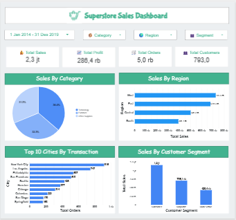
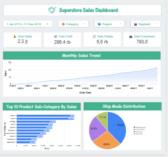

# 📊 Superstore Sales Dashboard

## Project Overview

This project analyzes the Sample Superstore dataset using Microsoft Excel and Looker Studio. The objective is to identify sales performance, customer segments, regional performance, product performance, and shipping trends through interactive dashboards.

## Tools

- Microsoft Excel
- Looker Studio

## Dataset

The dataset used in this project is included in this repository as a compressed ZIP file.

**Dataset:** `Superstore Data.zip`

## Dashboard

### Sales Overview



### Sales Insights



## Business Questions

1. Which region generates the highest sales?
2. Which product category generates the highest sales?
3. Which city records the highest number of transactions?
4. Which customer segment contributes the highest sales?
5. How do sales change over time?
6. Which product sub-category generates the highest sales?
7. Which ship mode is used most frequently?

## Key Insights

- The West region generated the highest sales.
- Technology was the best-performing product category.
- Consumer contributed the highest sales.
- Sales fluctuated over time with several seasonal peaks.
- Standard Class was the most frequently used shipping mode.
- A small number of product sub-categories contributed significantly to total sales.

## Recommendations

- Increase marketing efforts in high-performing regions.
- Focus inventory planning on top-selling product sub-categories.
- Develop strategies to improve sales in lower-performing regions.
- Monitor monthly sales trends to identify seasonal demand.
- Evaluate shipping performance to improve customer satisfaction.

## Repository Structure

```text
Superstore-Sales-Dashboard/
│
├── README.md
├── Superstore Data.zip
└── Dashboard/
    ├── dashboard_page1.png
    └── dashboard_page2.png
```

## Interactive Dashboard

[Looker Studio dashboard link here.](https://datastudio.google.com/reporting/f6e1d5a5-cb61-4199-81e7-1341a7ba4abc)

# 👤 Author

**Fatimah Azya Yuliardin**


